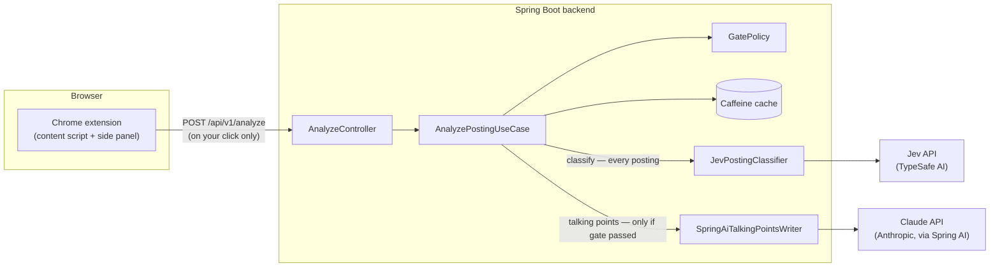

# JobLens

A Chrome extension + Spring Boot backend that reads the job posting you're looking at and
tells you:

1. **Real seniority vs. claimed seniority** — does the title match the actual scope?
2. **Red-flag language** — hidden overtime, vague scope, too many roles combined into one,
   no compensation info, unrealistic requirements, high-turnover signals.
3. **Visa sponsorship / relocation likelihood.**

Only for postings that pass *your* configurable gate does it also generate tailored talking
points (cover-letter angles, questions to ask, why the role fits) — using an LLM. Most
postings never reach the LLM at all; see [the non-negotiable rule](#how-classification-works)
below.

## Non-affiliation

JobLens is an independent, unofficial project. It is **not affiliated with, endorsed by, or
sponsored by LinkedIn, TypeSafe AI, or Anthropic.** It uses LinkedIn's publicly visible page
content (read by you, in your own browser, on pages you're already viewing), TypeSafe AI's
Jev API, and Anthropic's Claude API, as a paying/API-key-holding user of each — nothing more.

## How classification works

**Jev (TypeSafe AI's System One model) does all classification and scoring.** It never
generates free text — only typed answers with probabilities. **The LLM (Claude, via Spring
AI) only generates talking points, and only after a posting passes your gate.** This is
enforced structurally, not just by convention — see
[docs/adr/0003-jev-llm-separation.md](docs/adr/0003-jev-llm-separation.md).

## Architecture



Full design + every non-obvious decision (with why): [docs/architecture.md](docs/architecture.md)
and [docs/adr/](docs/adr/) — read those before the code if you're trying to understand *why*
something is built the way it is, not just what it does.

## Repo layout

```
backend/     Spring Boot API (Java 25, Spring Boot 4.1, hexagonal architecture)
extension/   Chrome MV3 extension (TypeScript, WXT) — thin client, no business logic
docs/        Architecture, ADRs, API reference
```

## Setup

### Prerequisites

- Java 25, Maven (or use `./mvnw`, no local Maven install needed)
- Node.js 24 LTS + npm, for the extension
- Docker, if you'd rather run the backend that way (see [Docker](#docker) below)

### Backend

```
cd backend
cp profile/candidate-profile.example.yml profile/candidate-profile.yml
# edit profile/candidate-profile.yml: your target seniority and sponsorship requirement
./mvnw test
./mvnw spring-boot:run
```

The backend now runs fully offline against `MockPostingClassifier`/`StubTalkingPointsWriter` —
no API keys needed to try it. `curl` it directly:

```
curl -X POST localhost:8080/api/v1/analyze \
  -H "Content-Type: application/json" \
  -d '{"url":"https://example.com/job","title":"Senior Backend Engineer","company":"Acme",
       "location":"Remote","descriptionText":"Own our payments platform. Salary $150k-$180k."}'
```

Interactive API docs: http://localhost:8080/swagger-ui/index.html — see
[docs/api.md](docs/api.md) for the full contract and error responses.

To use the real Jev/LLM adapters, set the env vars in [Env vars](#env-vars) below and flip the
corresponding `enabled` flags in `backend/src/main/resources/application.yml`
(`joblens.jev.enabled`, `joblens.ai.enabled` — both default `false`).

### Extension

```
cd extension
npm install
npm run compile   # type-check
npm test            # vitest
npm run build         # -> extension/.output/chrome-mv3
```

Load it: `chrome://extensions` → enable Developer mode → "Load unpacked" →
`extension/.output/chrome-mv3`. Click the JobLens toolbar icon to open the side panel, then
set your backend URL (and API key, if you've enabled auth) in Options. Navigate to a LinkedIn
job posting and click "Analyze this posting."

### Docker

```
cp .env.example .env   # fill in keys only if you're enabling the real Jev/LLM adapters
docker compose up --build
```

Mounts your `backend/profile/candidate-profile.yml` into the container; see
`docker-compose.yml`.

## Env vars

See [.env.example](.env.example) for the full, current list with context. In short:

| Variable | Required when | Notes |
|---|---|---|
| `ANTHROPIC_API_KEY` | `joblens.ai.enabled=true` | Talking-points generation. Never committed. |
| `JEV_API_KEY` | `joblens.jev.enabled=true` | Real classification. Never committed. |

Everything else (gate thresholds, cache size, rate limits, CORS origins, API-key auth) is
configured in `backend/src/main/resources/application.yml`, not env vars — see
[docs/architecture.md](docs/architecture.md) and the ADRs for why each default is what it is.

## Privacy

When you click "Analyze this posting" in the extension:

1. The text of **that one posting** (title, company, location, description) is sent to the
   backend URL you configured. Nothing is sent automatically, and nothing is sent for any
   posting you haven't explicitly clicked "Analyze" on.
2. Your backend forwards it to **Jev (TypeSafe AI)** for classification — always, for every
   posting analyzed.
3. **Only** for postings that pass your configured gate, your backend also forwards it to
   **Claude (Anthropic)**, via Spring AI, to generate talking points.
4. Your candidate profile (target seniority, sponsorship needs) lives in a file you control
   (`backend/profile/candidate-profile.yml`), git-ignored by default, and is sent to the LLM
   provider only alongside a gated posting's talking-points request — never to Jev, and never
   logged (see [CLAUDE.md](CLAUDE.md)'s logging rule).
5. The backend never logs posting text, candidate profile content, or API keys/secrets — see
   `ProblemDetailHandler` and the various adapter logging calls for what's actually logged
   (correlation IDs, model versions, error classes/messages — never content).

The extension itself only reads the page you're currently viewing, only when you click
"Analyze" — no crawling, no bulk scraping, no auto-applying, no background scanning.

## Known limits

- **LinkedIn's selectors are best-effort, not verified against a live page** (see
  [ADR-0010](docs/adr/0010-extension-architecture.md)) — this project's development
  environment has no way to browse to an authenticated LinkedIn posting. If extraction stops
  working, `extension/lib/siteAdapters/LinkedInAdapter.ts` is the one file to fix; that's what
  the `SiteAdapter` interface is for.
- **Only LinkedIn is supported today.** Adding another site means implementing `SiteAdapter`
  and registering it — see `extension/lib/siteAdapters/registry.ts`.
- **Request-size limiting is `Content-Length`-based**, not a streaming byte-counter — a
  chunked-encoding request without that header isn't size-limited. See ADR-0010.
- **Rate limiting only becomes real abuse protection once API-key auth is also enabled** — by
  itself it's keyed by a header value nobody validates, so it can be bypassed by rotating that
  header. See ADR-0005.
- **The Jev/LLM HTTP timeout hasn't been verified against a live call** in either provider —
  both environments this was built in lacked a real API key at the time. See ADR-0005.
- No custom extension icons yet (Chrome shows its default).
- Single-candidate, single-operator tool by design — not multi-tenant. "Per-user API key"
  means "the extension authenticates," not a multi-user account system.

## License

[Apache-2.0](LICENSE) — see [docs/adr/0008-license.md](docs/adr/0008-license.md) for why.

## Contributing / Security

See [CONTRIBUTING.md](CONTRIBUTING.md) and [SECURITY.md](SECURITY.md).
