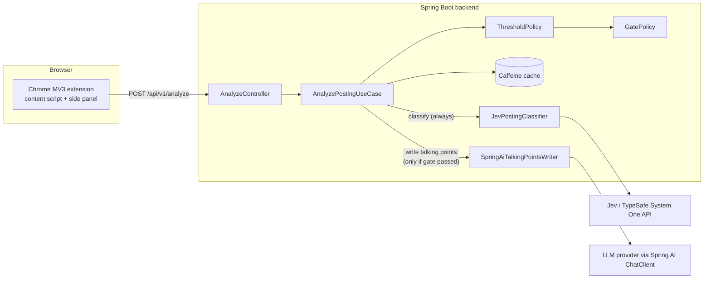

# Architecture — JobLens

Status: Phase 0 design, no code yet. See [../CLAUDE.md](../CLAUDE.md) for the non-negotiable
rule this design exists to enforce, and [adr/](adr/) for the reasoning behind individual
choices.

## 1. Shape of the system



The one fact worth re-reading twice: **every posting reaches Jev; only a minority, after
passing the gate, reach the LLM.** That asymmetry is the entire point of the gate.

## 2. Package structure

```
backend/src/main/java/io/github/fereshtehdev/joblens/
  analysis/
    domain/
      JobPosting, Analysis, Seniority, RedFlag, RedFlagKind, SponsorshipLikelihood,
      Probability, Verdict (sealed: Confident | Uncertain | Ignored),
      ThresholdPolicy, GatePolicy, GateDecision
    application/
      AnalyzePostingUseCase
      port/  PostingClassifier, TalkingPointsWriter, AnalysisCache
    adapter/
      in/web/   AnalyzeController, dto/ (AnalyzeRequest, AnalyzeResponse, ...), ProblemDetailHandler
      out/jev/  JevPostingClassifier, JevHttpClient, JevRequest/JevResponse, JevQuestionSchema
                (Phase 4 - active only when joblens.jev.enabled=true; see ADR-0009)
      out/ai/   SpringAiTalkingPointsWriter, TalkingPointsPrompt (Phase 3 - active only when
                joblens.ai.enabled=true; retry/circuit breaker composed by hand with
                Resilience4j's core modules, not its Spring Boot integration - see ADR-0005)
      out/cache/ CaffeineAnalysisCache (Phase 3 - replaced the Phase 2 InMemoryAnalysisCache,
                 which was deleted once this landed)
      out/mock/  MockPostingClassifier, StubTalkingPointsWriter (offline defaults; each stays
                 active whenever its real counterpart is disabled, which is the default for both)
  profile/
    domain/    CandidateProfile (reuses Seniority/SponsorshipLikelihood from analysis.domain
               directly - no separate TargetSeniority type; see ADR-0002)
    adapter/out/config/  CandidateProfileProperties (@ConfigurationProperties record, decided
                          in Phase 2 - simpler than a YAML loader since the shape is 1:1 with
                          the domain type; a @Bean in config.AnalysisConfig maps between them)
  config/
    AnalysisConfig (Phase 2/3: wires GateSettings/CandidateProfile/AnalyzePostingUseCase beans),
    web/RateLimitFilter, observability/CorrelationIdFilter (Phase 3 - self-registering
    Filter @Components, no separate SecurityConfig/ObservabilityConfig class needed),
    properties/  GateProperties, CacheProperties, RateLimitProperties, TalkingPointsResilienceProperties
                 (Phase 2/3), JevProperties (Phase 4) - all @ConfigurationProperties records,
                 Bean Validation, fail fast
extension/            thin TypeScript client (WXT project, see §6)
docs/
  architecture.md (this file)
  adr/
  api.md
```

This keeps the suggested structure from the brief almost unchanged — it was already right.
Two adjustments, both explained in ADRs:

- `profile/` stays a **sibling** of `analysis/`, not nested inside it. `GatePolicy` takes a
  `CandidateProfile` as a plain parameter; it does not import anything from
  `profile.adapter`. This keeps `analysis.domain` ignorant of *how* the profile is loaded —
  only application/config wiring knows that. See [ADR-0002](adr/0002-hexagonal-package-by-feature.md).
- `RedFlagKind` is split out from `RedFlag` as its own enum (one variant per Jev `noul`
  question — `hidden_overtime`, `vague_scope`, `too_many_roles`, `no_compensation_info`,
  `unrealistic_requirements`, `high_turnover_signals`) so `RedFlag` itself stays a simple
  `record RedFlag(RedFlagKind kind, Verdict verdict)`.

## 3. Domain model (sketch, not final field lists — Phase 1 will nail those down)

```java
record Probability(double value) {
    Probability {
        if (value < 0.0 || value > 1.0) throw new IllegalArgumentException(...);
    }
}

sealed interface Verdict permits Verdict.Confident, Verdict.Uncertain, Verdict.Ignored {
    record Confident(Probability probability) implements Verdict {}
    record Uncertain(Probability probability) implements Verdict {}
    record Ignored() implements Verdict {}
}

enum Seniority { JUNIOR, MID, SENIOR, STAFF_PLUS }

record SeniorityAssessment(Seniority claimed, Seniority actual, Verdict titleVsRealityVerdict) {}

enum RedFlagKind {
    HIDDEN_OVERTIME, VAGUE_SCOPE, TOO_MANY_ROLES,
    NO_COMPENSATION_INFO, UNREALISTIC_REQUIREMENTS, HIGH_TURNOVER_SIGNALS
}
record RedFlag(RedFlagKind kind, Verdict verdict) {}

enum SponsorshipLikelihood { EXPLICIT_YES, LIKELY, UNLIKELY, EXPLICIT_NO, UNKNOWN }
record SponsorshipAssessment(SponsorshipLikelihood visa, SponsorshipLikelihood relocation) {}

record Analysis(SeniorityAssessment seniority, List<RedFlag> redFlags,
                 SponsorshipAssessment sponsorship, String jevModelVersion) {}

record GateDecision(boolean passed, List<String> reasons) {}
```

`ThresholdPolicy.toVerdict(Probability, GateProperties.Thresholds)` maps a raw probability to
a `Verdict`. `GatePolicy.evaluate(Analysis, CandidateProfile, GateProperties)` produces a
`GateDecision`. Both are pure functions — no I/O, no Spring, exhaustively unit-tested.

## 4. Ports (owned by `analysis.application.port`)

```java
interface PostingClassifier {
    Analysis classify(JobPosting posting);
}

interface TalkingPointsWriter {
    TalkingPoints write(JobPosting posting, Analysis analysis, CandidateProfile profile);
}

interface AnalysisCache {
    Optional<Analysis> get(PostingFingerprint key);
    void put(PostingFingerprint key, Analysis analysis);
}
```

`AnalyzePostingUseCase` orchestrates: fingerprint → cache lookup → `classifier.classify()` →
`ThresholdPolicy` → `GatePolicy.evaluate()` → if passed, `writer.write()` → assemble result →
cache it. It depends only on the three ports above plus the two pure policies — nothing else.

## 5. Jev anti-corruption layer

`JevQuestionSchema` (loaded from `analysis/jev-questions.yml`, not scattered string literals)
declares the seven questions from the brief: `actual_seniority` (choice), `title_vs_reality`
(choice), six `noul` red-flag questions, `visa_sponsorship` and `relocation_support` (choice).
`JevHttpClient` is a thin `RestClient`-based wrapper around `POST /v1/systemone` (verified
shape — see [ADR-0001](adr/0001-version-baseline.md)). `JevPostingClassifier` implements
`PostingClassifier`: builds the request from `JobPosting` + schema, calls the client, maps
`choice`/`score`/`noul` answers back into `Analysis` via `ThresholdPolicy`, and logs the
`model` field from the response (e.g. `jev-1.13.0`) for traceability. Jev request/response
DTOs never cross into `analysis.domain` or `analysis.application`.

## 6. API

```
POST /api/v1/analyze
  request:  { url, title, company, location, descriptionText }
  response: { seniority, redFlags[], sponsorship, gate: { passed, reasons[] }, talkingPoints? }
```

Every probability-derived field carries its `Verdict` (confident/uncertain/ignored) — the
response never states an uncertain judgment as fact. `talkingPoints` is present only when
`gate.passed` is `true`. Documented with springdoc OpenAPI (Phase 2/6).

## 7. Extension (built in Phase 5 — see ADR-0010)

WXT-based MV3 project (chosen over CRXJS — see [ADR-0007](adr/0007-extension-tooling.md)),
under `extension/`:

```
extension/
  wxt.config.ts, package.json, tsconfig.json, vitest.config.ts
  entrypoints/
    background.ts        sets side-panel-opens-on-icon-click behavior
    content.ts            idle content script (matches *://*.linkedin.com/*); extracts and
                           replies only on an EXTRACT_POSTING message - never on load
    sidepanel/             privacy notice -> "Analyze this posting" -> calls the backend directly
    options/                backend URL + API key form
  lib/
    jobPosting.ts           JobPostingData shape (mirrors AnalyzeRequest)
    siteAdapters/            SiteAdapter interface, LinkedInAdapter (first impl), registry
    messages.ts              typed content-script <-> side-panel message contract
    api.ts                   fetch wrapper + DTOs mirroring AnalyzeResponse.java exactly
    storage.ts                browser.storage.local wrapper (settings + privacy-ack flag)
    render.ts                  pure formatting of the backend's response - no thresholds,
                                no gate logic, no re-classification (keeps "no business
                                logic in the extension" true in code, not just intent)
```

Uses WXT's ambient `browser` global (not the raw `chrome` API - see ADR-0010 for why).
`render.ts` and `LinkedInAdapter.ts` are unit-tested with Vitest; the LinkedIn selectors are
best-effort and **not verified against a live page** (flagged in ADR-0010). No business logic
client-side — the extension is a dumb terminal for the backend's judgment.

## 8. Phases (unchanged from the brief; stop after each for review)

0. Design (this document + ADRs). No code.
1. Domain + application layers, pure unit tests, ArchUnit rules. No frameworks.
2. Web adapter, mock adapters, config, error handling — runnable end to end with `curl`
   against `MockPostingClassifier`/`StubTalkingPointsWriter`.
3. Spring AI talking-points adapter, Caffeine cache, rate limiting, resilience, observability.
4. Real Jev adapter, confirmed against live docs again, with mock-server tests.
5. Extension wired to the backend. Also closed the API-key auth/CORS/request-size-limit gap
   deferred from Phase 3 (ADR-0005) - see ADR-0010.
6. Docker, CI, docs and repo polish.

## 9. Open items / what I'd flag before Phase 1

- ~~Resilience4j's Spring Boot integration is not yet confirmed compatible with Spring Boot
  4.1 / Framework 7.~~ **Resolved in Phase 3, and the risk was real**: `resilience4j-spring-boot3`
  has an explicit runtime check that refuses to start on anything but Boot 3.x
  (`IncompatibleSpringBootVersionException`), confirmed by actually running the app. Switched
  to the framework-agnostic `resilience4j-circuitbreaker` + `resilience4j-retry` core modules,
  composed by hand in `SpringAiTalkingPointsWriter` (`Retry.decorateSupplier`/
  `CircuitBreaker.decorateSupplier`) — see ADR-0005 and ADR-0001's Phase 3 update.
- Same recency caveat applies loosely to `springdoc-openapi` (`3.1.1`) — re-check at Phase 6
  when OpenAPI docs get added (not needed yet; no phase before 6 uses it).
- WXT is pre-1.0 (`~0.21.x`) but active and described as production-ready; acceptable for a
  thin client with no business logic. Revisit only if Phase 5 surfaces real friction.
- Two more Boot-4 modularization surprises turned up in Phase 2/3, both fixed and documented
  in ADR-0001: `@WebMvcTest`/`@AutoConfigureMockMvc` moved to a separate
  `spring-boot-starter-webmvc-test` module and package, and `spring-boot-starter-aop` no
  longer exists at all (replaced by depending on `org.aspectj:aspectjweaver` directly). Worth
  assuming more of these surface in Phase 4 (Jev's `RestClient` usage) and Phase 6 (CI,
  springdoc) rather than trusting any pre-Boot-4 memory of a starter's contents.
